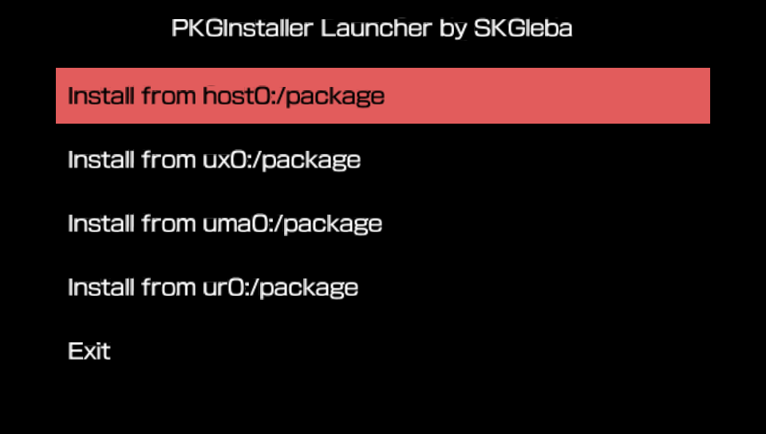
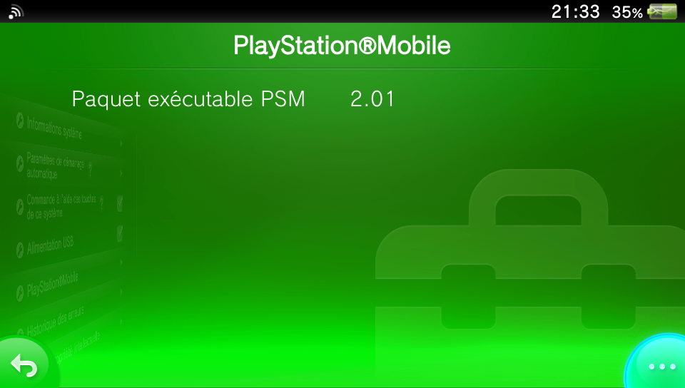
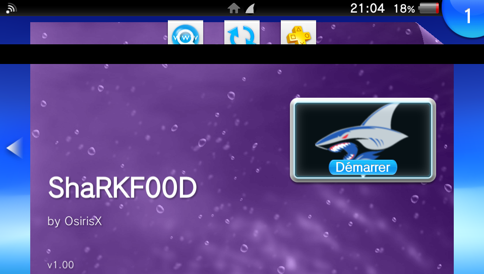
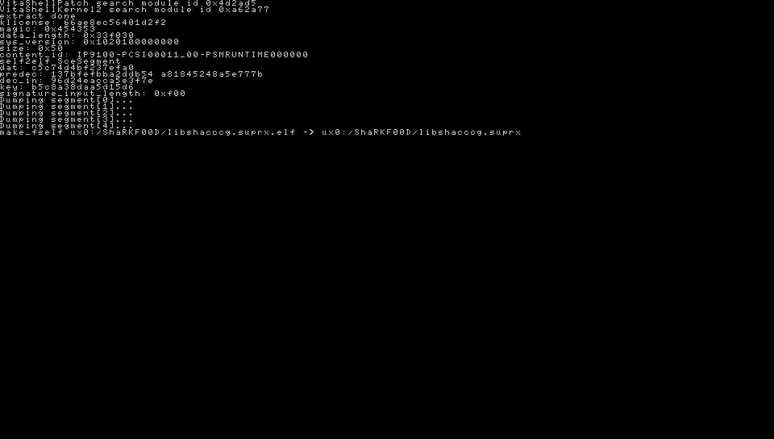

# Extract libshacccg.suprx

After all those years, we finally have a legal shader compiler. And thanks again to PSM. It may not have served well its original purpose, but for us it's a gift. We saw the first native hack \(rejuvenate\), allowing newcomer to make unity homebrew easly on our vita, and now it provide us a way to have a legal shader compiler. But for that we need to extract libshacccg.suprx first.

## Installing the PSM runtime

First of all we need to have the PSM runtime, for those who already have the 2.01 you can skip this part.  
You will need 4 files.

1. [PKGinstallerLauncher by SKGleba](https://vitadb.rinnegatamante.it/#/info/381)
2. [The 3 files of the PSM runtime ](http://psm.cbps.xyz/devtools.php?type=psm-runtime)\(1.00, 2.00, 2.01\) 

Put the 3 files of the PSM runtime in ux0:package \(create the folder\) then open PKGInstallerLauncher

Once you are in the Package Installer, install the 3 PSM runtime, 1.00, 2.00 and 2.01 \(The order is very important, else it will fail\)  
  
Note : If you have a black screen instead of the pkg installer, please disable all your plugins.  

Once it's done, you can check in system info -&gt; PlayStation Mobile tab the version of the runtime

## Extracting with ShaRKF00D

ShaRKF00D is an app by [OsirizX](https://github.com/OsirizX/ShaRKF00D) made to allow user to dump the libshacccg.suprx in one step. You can get it [here](https://github.com/OsirizX/ShaRKF00D/releases/download/1.3/ShaRKF00D.vpk)

Same stuff as usual, you transfer the vpk and install it with vitashell.

Once you have it, it's simple. Open the app and it will do the job without any user input. 

Once it's finished you can check if you have the .suprx in ur0:data.

  
And that's all, now you are ready to use upcoming project that will rely on the shader compiler like flycast !  
  
Note 2 : If the app relying on libshacccg doesn't work, make sure like with retroarch that you can access ur0:data folder with its inbuilt file manager. If not, then rename ur0:data to something else, then create a data folder and move all the files here. That should make the folder visible.

